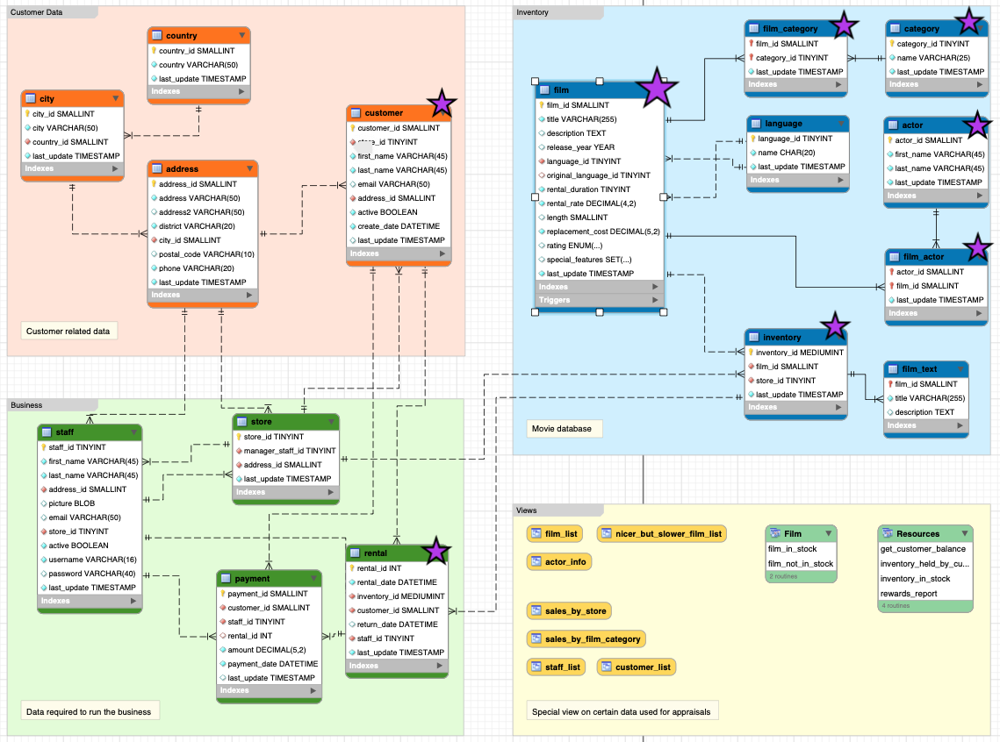

🔍**`Consultas SQL en BBDD 'SAKILA'`**🔍

En el siguiente repositorio encontrará un código de SQL con ¿25? preguntas(Consultas).
La BBDD🤖 `Sakila` se ha utilizado para realizar consultas y análisis de datos en el contexto de una tienda de alquiler de películas 🎬, y poder dar respuesta.
En ella, podemos ver tablas como:
- film (películas) 
- actor (actores) 
- customer (clientes) 
- rental (alquileres)
- category (categorías)
- inventory (inventario)
Entre otras que fueron indispensables a la hora de las consultas. 

*`DIAGRAMA`*:👇

👉 Se tuvo en cuenta en la estructura del código:
- Queries básicas y abanzadas: `SELECT`
- Funciones: `GROUP BY`, `WHERE` y `HAVING`.
- Uso de `JOINS`
- Subconsultas
- `CTE’s`
Entre otras más!

🎯 ¡Ahora bien, para poder ver los resultados de las consultas, debes tener la tabla con los mismos datos y empezar a ejecutar cada una en `MySQLWorkbench`!

Realizado por Monica Valencia.
¡Muchas gracias! 😊
